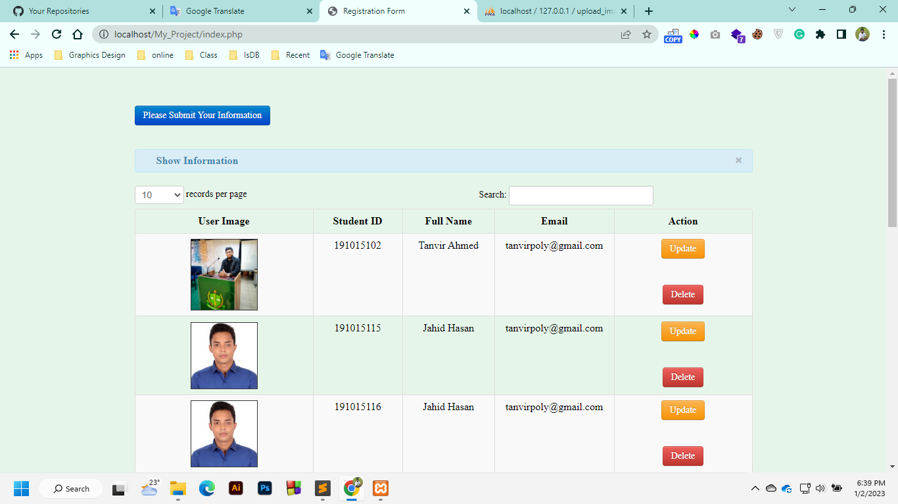
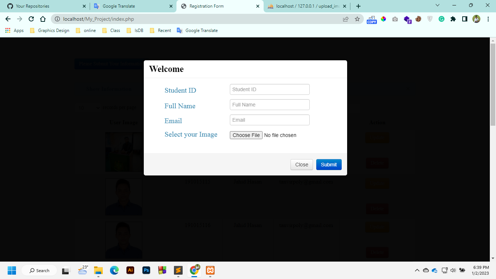
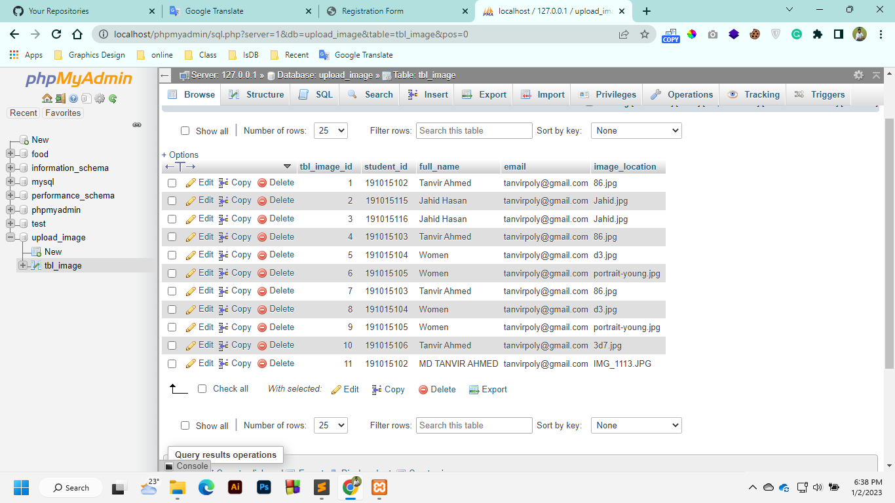

# Output

---
<h2>Green University of Bangladesh </h2>

<h3>Dept. of Computer Science Engineering</h3>

Course Title: Database System Lab

Course Code: CSE-310

---

 <h2>Project Name: Online Registration Form</h2>

 <h4>Language Used: PHP</h4>
 <h4>Database: MySQL</h4>
 <h4>User Interface Design: HTML, AJAX, JQUERY, JAVASCRIPT</h4>
 <h4>Web Browser: Google Chrome, Mozilla, IE8</h4>
 <h4>Software: XAMPP/ Wamp or anyone</h4>

---

<h2>User side screenshot</h2>

---

<h2>Sql screenshot</h2>

---

<h1 id="test-title">Project Proposal</h1>

<object data="loremipsum.pdf#page=2" type="application/pdf" width="700px" height="700px">
    <embed src="loremipsum.pdf#page=2">
        
Click here for Proposal <a href="Project_Proposal.pdf"> Proposal </a>.

    </embed>
</object>

---

<h1 id="test-title">Project Report</h1>

<object data="loremipsum.pdf#page=2" type="application/pdf" width="700px" height="700px">
    <embed src="loremipsum.pdf#page=2">
        
Click here for Report <a href="Project_Report.pdf"> PDF </a>.

    </embed>
</object>

---

<!-- all link is here -->

### Contact me:

[E-mail](tanvirpoly@gmail.com)

[Linkedin]( https://www.linkedin.com/in/tanvirx/)

[Facebook]( https://www.facebook.com/tanvirfbid)

